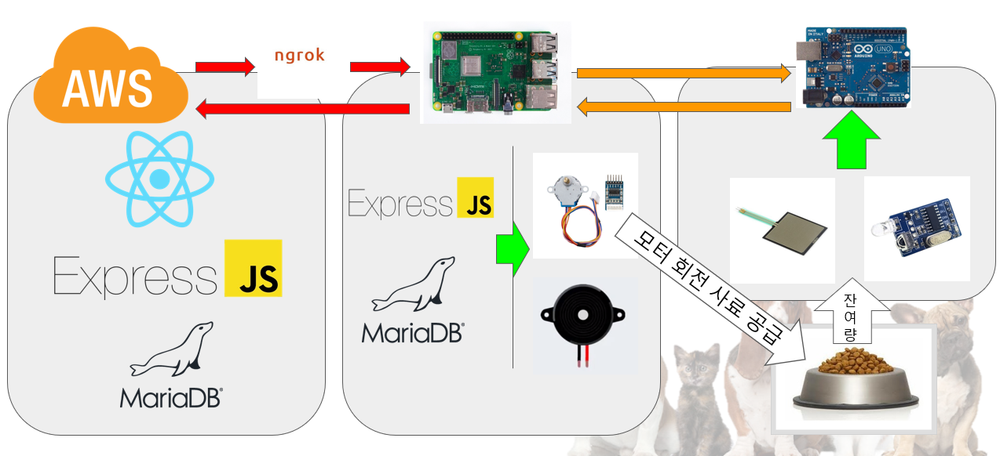

# 프로젝트 밥멍냥
Common PJT team3

## 프로젝트 개요
IoT 펫푸드 케어 서비스  
[발표자료 PPT 링크](IoT-펫푸드-케어-밥멍냥(최종제출용).pdf)

## 핵심 기능
1. 사료 정보 검색    
    원하는 사료 정보 검색

2. 자동 사료 지급  
   지정된 시간에 맞게 사료 지급
3. 식사량 모니터링  
   센서를 통해 얼마나 먹었는지 모니터링
  - 그래프를 통한 시각화
## 서비스 아키텍처
  

## 사용된 기술 스택
**Front**  
REACT.js  
**Back**  
Node.js(Express), MySQL(MariaDB)  
**HW**  
Node.js(Express), Linux/C(Raspberry Pi)